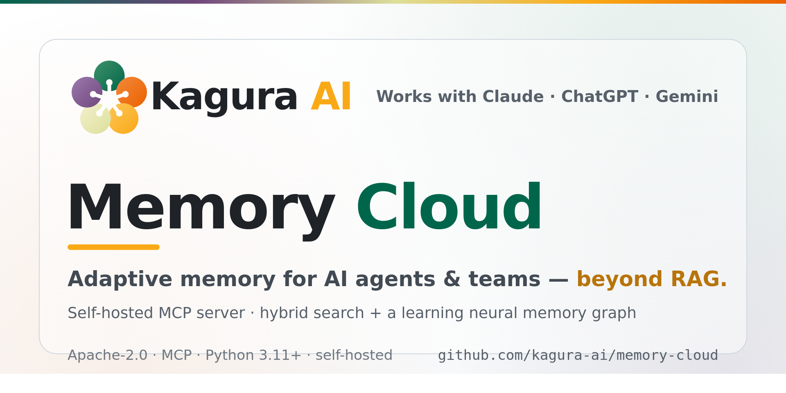
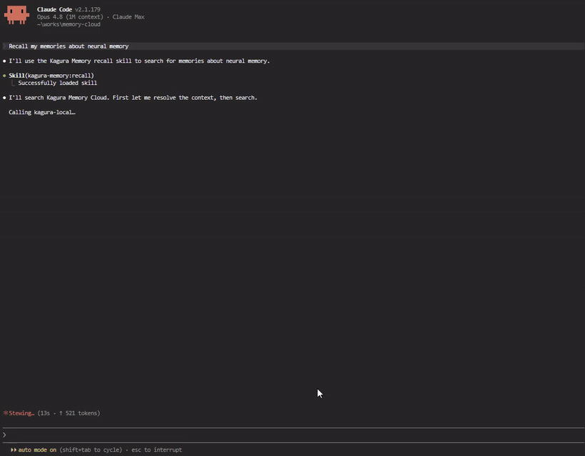

<p align="center">
  <a href="https://www.kagura-ai.com/ja/">
    <picture>
      <source media="(prefers-color-scheme: dark)" srcset="docs/assets/social-preview.png">
      
    </picture>
  </a>
</p>

<p align="center">
  <a href="README.md">English</a> · 日本語
</p>

<p align="center">
  <strong>AI エージェントとチームのための適応的メモリ</strong> — セルフホスト、RAG を超えて。<br>
  検索するたびに賢くなる MCP サーバー:<br>
  ハイブリッド検索 + どのメモリ同士が関連するかを学習する neural memory graph。
</p>

<p align="center">
  <a href="LICENSE"></a>
  <a href="https://github.com/kagura-ai/memory-cloud/actions/workflows/ci.yml"></a>
  <a href="https://codecov.io/gh/kagura-ai/memory-cloud"></a>
  <a href="https://www.python.org/downloads/"></a>
  <a href="https://nodejs.org/"></a>
  <a href="https://modelcontextprotocol.io/"></a>
  <a href="https://safeskill.dev/scan/kagura-ai-memory-cloud"></a>
</p>

<p align="center">
  Claude、ChatGPT、Gemini、その他あらゆる MCP 互換クライアントで動作。<br>
  <a href="https://github.com/kagura-ai/kagura-memory-python-sdk"><strong>Python SDK (KaguraClient / KaguraAgent)</strong></a>
</p>

<p align="center">
  <a href="https://www.kagura-ai.com/demo/terminal-en-cli-2x.mp4">
    
  </a>
  <br>
  <em>Claude Code から過去のメモリを recall — MCP 経由の Kagura Memory。<a href="https://www.kagura-ai.com/demo/terminal-en-cli-2x.mp4">▶ デモを見る</a></em>
</p>

## なぜ Kagura Memory Cloud か？

> **AI は会話のたびに全てを忘れる。Kagura はそれを解決し、検索するたびに賢くなる。**

多くの AI メモリツールはベクトル DB にチャット UI を被せただけ。Kagura は違います — Karpathy の [LLM Wiki](https://gist.github.com/karpathy/442a6bf555914893e9891c11519de94f) パターンを **チーム規模で完全実装**:

| アプローチ | ストレージ | 複利成長 (compounding) | 規模 |
|---|---|---|---|
| Vector DB / RAG | embedded chunks | なし — 取得専用 | 任意 |
| Karpathy の LLM Wiki | markdown ファイル | LLM がページを書き換え | 個人 (約 100 ページ) |
| **Kagura Memory Cloud** | **PostgreSQL + Qdrant + Neural graph** | **Hebbian + Sleep Maintenance** | **チーム / 組織** |


| 機能 | 説明 |
|------|------|
| **Adaptive Memory** | 検索のたびに関連メモリ間の接続が自動強化。使うほど `explore()` が隠れた関連性を発見する精度が上がる |
| **Hybrid Search** | Semantic (OpenAI/Ollama) + BM25 キーワード — top-1 精度 96% |
| **AI Reranking** | Ollama (ローカル・無料)、Voyage AI、Cohere — cross-encoder reranker で精度向上 |
| **Neural Memory Graph** | Hebbian 学習がバックグラウンドで知識グラフを構築。`explore()` がそれを辿り偶発的発見を提供 |
| **Agent Memory Substrate** | 単なる知識ストアを超えて — delivery mode (pin / 時刻トリガ)、サーバー署名の trust boundary、agent state レーン、retrieval feedback シグナル。自律エージェントのループに必要なプリミティブ群 |
| **45 の MCP ツール** | Memory、Agent Substrate、Neural edges、Contexts、Tags、Files (R2)、Analyses (broadlistening)、Resources、Sleep Maintenance、Usage、API-Key Bindings |
| **マルチプロバイダ** | 埋め込みに OpenAI か Ollama (ローカル・非公開・コストゼロ) |
| **チーム対応** | Workspace、RBAC、context 分離、共有メモリ |
| **Web UI** | Next.js ダッシュボード — context、検索設定、メンバー管理 |
| **5 分セットアップ** | `./setup.sh` のみ |

## アーキテクチャ

```
Workspace (チーム/組織)
├── Context A ("my-project")     ← フォルダのような単位
│   ├── Memory 1                 ← 3 層構造: summary / context / content
│   ├── Memory 2
│   └── Neural edges (Hebbian)   ← 自動接続
├── Context B ("learning-notes")
│   └── ...
└── Members (Owner/Admin/Member/Viewer)
```

### LLM Knowledge Base — 5 層実装

Karpathy の [LLM Wiki パターン](https://gist.github.com/karpathy/442a6bf555914893e9891c11519de94f) は「生きた知識ベース」を 5 層で記述しています (RAG を超えるパターン)。Kagura はこの 5 層全てをチーム規模で実装:

| Layer | Kagura の実装 | Karpathy パターンとの違い |
|---|---|---|
| **Ingest** | REST `/api/v1/memory`、MCP `remember`、R2 ファイルストレージ、resource tokens | + バイナリ blob、+ マルチテナント |
| **Compile** | **MCP-as-compile-API** — chat agent が構造化 tool call (`remember(summary, content, type, tags)`) で compile + Sleep Maintenance がバッチ統合 | バッチ wiki 書き換えではなく連続マイクロ compile — schema 強制 |
| **Index** | 三重 index: **BM25** (keyword) + **Qdrant** (semantic) + **Hebbian graph** (relational) — 全自動維持 | 手動の `index.md` メンテ不要 |
| **Query** | Hybrid Search + AI Reranker + `explore` グラフ探索 | markdown grep を超え、semantic + relational query をサポート |
| **Enhance** | **Hebbian 学習** — `recall()` のたびに共起 memory 間の edge が強化。Sleep Maintenance が定期統合 | LLM コストゼロのバックグラウンド成長 (LLM による page 書き換えと違う) |

**Compounding loop**: 現状は明示的 (user/agent が回答合成後に `remember()` を呼ぶ)。回答の自動書き戻しはノイズを抑えるため意図的に opt-in。


### Adaptive Memory: 2 つの検索経路

Kagura は **精密検索** と **発見** を独立した 2 経路に分け、それぞれを用途特化で最適化:

```
recall()  ──→ Hybrid Search (semantic + BM25) ──→ [Reranker] ──→ 精密結果
                      │
                      └──→ Hebbian 学習 (バックグラウンド) ──→ グラフ edge が成長
                                                                 │
explore() ──→ グラフ探索 (Neural Memory) ←───────────────────────┘  関連発見
```

- **`recall()`** — 精密検索。Hybrid (semantic 60% + BM25 40%) + 任意の AI reranking。最も関連度の高いメモリを返す
- **`explore()`** — 発見。Neural Memory グラフを辿り、キーワード検索では拾えない関連メモリを見つける
- **Hebbian 学習** — `recall()` のたびに共起したメモリ間の edge が暗黙に強化。明示的な学習不要で、使うほどグラフが有機的に成長

この分離は意図的です。グラフ信号を recall に混ぜると精度が落ちる ([ベンチマーク検証済み](docs/neural-memory-evaluation.md))。各経路が自分の得意領域に集中する設計。

**データ分離:** 全データは `workspace_id → context_id → user_id` でフィルタ。境界を越えた漏洩なし。Qdrant は単一 collection + payload filtering。

**技術スタック:** FastAPI (async) · PostgreSQL · Qdrant · Redis · Next.js 16 · OAuth2 · MCP over Streamable HTTP

## クイックスタート

### 動作要件

|  | 最小 | 推奨 |
|--|------|------|
| CPU | 2 コア | 4 コア以上 |
| RAM | 4 GB | 8 GB 以上 |
| ディスク | 10 GB 空き | 20 GB 以上 空き |

### 前提

- Docker と Docker Compose
- Python 3.11+
- Node.js 20+
- 埋め込み用 OpenAI API キー — または Ollama (ローカル埋め込み)
- OAuth2 クレデンシャル (任意 — OAuth 無しでもパスワード + MFA ログイン可)

### セットアップ

**ワンライナー:**

```bash
git clone https://github.com/kagura-ai/memory-cloud.git
cd memory-cloud
./setup.sh
```

**Claude Code 併用:**

```bash
git clone https://github.com/kagura-ai/memory-cloud.git
cd memory-cloud
claude   # 起動後 /setup
```

**ステップ個別実行:**

```bash
# 1. Clone
git clone https://github.com/kagura-ai/memory-cloud.git
cd memory-cloud

# 2. 環境設定 (secrets 生成、API キー入力)
(cd backend && python3 -m src.cli.setup_env)

# 3. サービス起動
docker compose up -d

# 4. マイグレーション
(cd backend && alembic upgrade head)

# 5. admin 作成 (対話式 — パスワード/MFA/API キー/埋め込みプロバイダ設定)
(cd backend && python3 -m src.cli.create_admin)

# Backend API:  http://localhost:8080
# Frontend UI:  http://localhost:3000
# API docs:     http://localhost:8080/redoc
```

**`.env.local` 設定** (`setup_env` が自動構成):

| 設定 | 必須 | 説明 |
|------|------|------|
| `API_KEY_SECRET` | **必須** | API キー暗号化用 secret (自動生成) |
| `JWT_SECRET` | **必須** | JWT トークン用 secret (自動生成) |
| `OPENAI_API_KEY` | **必須**\* | 埋め込み用 OpenAI API キー |
| `OLLAMA_BASE_URL` | 任意 | Ollama URL (既定: `http://localhost:11434`) |
| `EMBEDDING_PROVIDER` | 任意 | `openai` (既定) または `ollama` |
| `GOOGLE_CLIENT_ID/SECRET` | 任意 | Google OAuth2 ログイン (任意 — パスワードログインも可) |
| `GITHUB_CLIENT_ID/SECRET` | 任意 | GitHub OAuth2 ログイン (任意) |

\* メモリ機能には `OPENAI_API_KEY` または稼働中の Ollama が必要。

### Admin CLI

| コマンド | 用途 |
|----------|------|
| `python3 -m src.cli.setup_env` | secrets 生成 + `.env.local` 構成 (Docker 起動前) |
| `python3 -m src.cli.create_admin` | admin + workspace + API キー + `.mcp.json` + 埋め込み設定 |
| `python3 -m src.cli.reset_password` | パスワード / MFA リセット |
| `python3 -m src.cli.delete_admin` | admin 削除 (再作成用) |

> `backend/` ディレクトリで実行。Docker API コンテナの起動が必須。

## MCP クライアント設定

### Claude Code (推奨)

Claude Code + Kagura Memory Cloud で、**セッション / マシン / プロジェクト横断の永続・検索可能・チーム共有メモリ** を AI アシスタントに与えます。

**Claude Code の組込みメモリで足りないのはなぜ？**

| | Claude Code メモリ | Kagura Memory Cloud |
|---|---|---|
| 保存場所 | ローカルファイル (`~/.claude/`) | クラウド (PostgreSQL + Qdrant) |
| 検索 | ファイル名のみ | Hybrid Search (semantic + 全文) |
| 共有 | 単一マシン | RBAC 付き team workspace |
| 構造 | フラット markdown | 3 層 + Neural Memory graph |
| プロジェクト横断 | プロジェクトごと | MCP で任意プロジェクト |

**セットアップ (3 ステップ):**

1. サービス起動後 `http://localhost:3000/workspace/integrations/api-keys` で API キー作成
2. `.mcp.json.example` を `.mcp.json` にコピーし workspace ID と API キーを設定:

```bash
cp .mcp.json.example .mcp.json
# .mcp.json を編集 — URL の workspace_id と API キーを入れる
```

3. Claude Code を再起動して確認:
```
あなた: "メモリの context 一覧を教えて"
→ AI が list_contexts() を呼ぶ

あなた: "覚えておいて: API は JWT 1h expiry + refresh token rotation"
→ AI が remember() で恒久保存

あなた: "認証について何を知ってる？"
→ AI が recall() で即検索、数ヶ月後でも発見
```

> `.mcp.json` は `.gitignore` 済み — 絶対に commit しない (API キーが入るため)。
> プロジェクトごとはプロジェクトルート、全体設定は `~/.claude/.mcp.json` に配置。

### Claude Desktop / Claude Chat (Web)

**Claude Desktop**: `.mcp.json` の形式は Claude Code と同一。プロジェクトルートまたは `~/.claude/.mcp.json` に置く。

**Claude Chat (claude.ai)**: Settings > Integrations でリモート MCP サーバを追加:
1. "Add Integration" → "Custom MCP Server"
2. MCP エンドポイント URL: `https://your-domain.com/mcp/w/{workspace_id}`
3. `Authorization: Bearer kagura_{your_api_key}` ヘッダを追加

> Claude Chat は `localhost` 不可、公開 URL が必須。production 配備または tunnel (ngrok、Cloudflare Tunnel 等) を使う。

### ChatGPT Desktop

ChatGPT デスクトップ版は MCP サーバ対応。Settings > MCP Servers から追加:
1. サーバ URL: `https://your-domain.com/mcp/w/{workspace_id}`
2. 認証: Bearer トークン `kagura_{your_api_key}`

> Claude Chat と同様に公開 URL が必要。ローカル開発では tunnel または REST API 直接使用を推奨。

### Gemini CLI

`.gemini/settings.json` (プロジェクトルートまたは `~/.gemini/settings.json`) に追加:

```json
{
  "mcpServers": {
    "kagura-memory": {
      "url": "http://localhost:8080/mcp/w/{workspace_id}",
      "headers": {
        "Authorization": "Bearer kagura_{your_api_key}"
      }
    }
  }
}
```

### その他の MCP クライアント / REST API

MCP 互換クライアントなら Streamable HTTP 経由で接続可。MCP 非対応クライアントは REST API を直接利用:

```bash
# メモリ検索
curl -X POST -H "Authorization: Bearer kagura_{your_key}" \
  -H "Content-Type: application/json" \
  -d '{"query": "your search", "context_id": "..."}' \
  http://localhost:8080/api/v1/memories/search
```

## MCP ツール

11 カテゴリ・全 45 ツール。Workspace ロール: **Owner** > Admin > Member > **Viewer** (read-only)。Context ロール: **Owner** > Editor > Viewer。Private context は作成者のみ閲覧可。Member を特定 context に allowlist で制限可能。

### Memory (6)

| ツール | 説明 | 必要ロール |
|--------|------|------------|
| `remember` | 新規メモリ保存 (summary + content + type、任意で `delivery_mode`) | Member+ |
| `recall` | Hybrid Search でメモリ検索 (`trust_tier` フィルタ対応) | Viewer+ |
| `reference` | メモリの 3 層詳細取得 | Viewer+ |
| `update_memory` | メモリ更新 / 外部 ID で upsert | Member+ |
| `forget` | ソフト削除 (30 日保持) | Member+ |
| `explore` | Neural Memory graph で関連メモリ発見 | Viewer+ |

### Agent Substrate (5)

自律エージェントのループに必要なプリミティブ群 — 詳細は [Concepts › Agent Memory Substrate](docs/concepts.md#agent-memory-substrate)。

| ツール | 説明 | 必要ロール |
|--------|------|------------|
| `load_pinned` | always-load メモリ (`delivery_mode="always"`) を決定的にロード — Goal / Guardrail / ポリシー用 | Viewer+ |
| `recall_upcoming` | 近日の Time Memory (`type="time"`、`delivery_mode="on_trigger"`) を列挙 | Viewer+ |
| `set_state` | エージェントの scratch state を upsert (key→value、任意 TTL、recall から除外) | Editor+ |
| `get_state` | state を 1 件取得、または context の全 live state を列挙 | Viewer+ |
| `feedback` | recall したメモリが有用だったかを記録 (append-only シグナル) | Viewer+ |

### Neural Edges (4)

| ツール | 説明 | 必要ロール |
|--------|------|------------|
| `list_edges` | メモリに接続された edge 一覧 | Viewer+ |
| `create_edge` | 2 メモリ間に edge 作成 | Member+ |
| `update_edge` | edge の weight / type 更新 | Member+ |
| `delete_edge` | 2 メモリ間の edge 削除 | Member+ |

### Contexts (7)

| ツール | 説明 | 必要ロール |
|--------|------|------------|
| `get_context_info` | context メタデータとガイドライン取得 | Viewer+ |
| `list_contexts` | workspace 内の context 一覧 | Viewer+ |
| `create_context` | context 新規作成 | Owner/Admin |
| `update_context` | context 設定更新 (summary、usage guide、resource_id、is_public) | Editor+ |
| `delete_context` | context とその全メモリを削除 | Owner/Admin |
| `merge_contexts` | source context から target context へメモリを統合 | Owner/Admin |
| `update_search_config` | context 単位で hybrid search 重みと reranker 設定を調整 | Editor+ |

### Tags (1)

| ツール | 説明 | 必要ロール |
|--------|------|------------|
| `list_tags` | context 内の tag 語彙一覧 (remember/recall 前に呼んで揃える用途) | Viewer+ |

### Files / R2 添付ファイル (5)

| ツール | 説明 | 必要ロール |
|--------|------|------------|
| `init_file_upload` | quota 予約 + presigned PUT URL 発行 (R2、≤100 MiB) | Member+ |
| `complete_file_upload` | R2 PUT 後にアップロード確定、sha256 検証、status=uploaded に遷移 | Member+ |
| `list_files` | workspace 内のアップロード済み (非削除) ファイル一覧 (新しい順) | Viewer+ |
| `get_file_download_url` | ファイルへの presigned GET URL 発行 | Viewer+ |
| `delete_file` | ファイルオブジェクトのソフト削除 | Member+ |

### Analyses — Broadlistening (5)

メモリを UMAP + KMeans + LLM ラベリング (kouchou-ai 方式) で大規模クラスタリング。質的分析用途。

| ツール | 説明 | 必要ロール |
|--------|------|------------|
| `analyze_context` | 分析 run 開始 (`dry_run=true` でコスト試算のみ可) | Owner + Pro プラン + BYOK + quota |
| `list_analyses` | context の過去分析 run 一覧 | Owner |
| `get_analysis` | 完了済み分析 (クラスタ、ラベル、統計) 取得 | Owner |
| `get_active_analysis` | 実行中分析の取得 (あれば) | Owner |
| `get_cluster` | 単一クラスタの所属メモリを drilldown | Owner |

### Resources — 外部データ取り込み (6)

| ツール | 説明 | 必要ロール |
|--------|------|------------|
| `setup_resource` | public context 作成 + resource token 発行 | Owner/Admin + Pro プラン |
| `setup_connector` | ai-worker チャットコネクタを provision (resource + connector 行 + token) | Owner/Admin + connector seats |
| `list_resource_tokens` | workspace の有効 resource token 一覧 | Owner/Admin |
| `ingest_events` | resource に batch upsert/delete events (最大 100 events、session-auth MCP 経路) | Member+ |
| `get_resource_impact` | resource 統計 (token 数、memory 数、schema version) | Viewer+ |
| `get_resource_schema` | resource のフィールド定義取得 | Viewer+ |

### Sleep Maintenance (3)

バックグラウンドでメモリ統合 (decay、edge pruning、テーマ要約) を実行。

| ツール | 説明 | 必要ロール |
|--------|------|------------|
| `get_sleep_history` | 過去 sleep run 一覧 | Viewer+ |
| `get_sleep_report` | sleep run の詳細レポート (全 action 込み) | Viewer+ |
| `rollback_sleep_run` | 完了済み sleep run の全 action をロールバック | Member+ (report 作成者のみ) |

### Usage (1)

| ツール | 説明 | 必要ロール |
|--------|------|------------|
| `get_usage` | workspace の現在使用量 (memory / context / member / MCP 呼出/日) | Viewer+ |

### API-Key Bindings (2)

| ツール | 説明 | 必要ロール |
|--------|------|------------|
| `list_my_bindings` | public-bound API キー一覧 (read-only、owner スコープ) | Viewer+ |
| `describe_binding` | `key_id` か `context_id` の一方で binding を 1 件記述 (read-only、owner スコープ) | Viewer+ |

## REST API

MCP ツールに加えてフル REST API を提供:

- **Memory**: remember、recall、reference、forget、explore (`/api/v1/memory/*`)
- **Contexts**: CRUD、検索設定 (`/api/v1/contexts/*`)
- **Attachments**: メモリ添付ファイル (`/api/v1/attachments/*`、5MB 上限)
- **Workspaces**: 管理、メンバー、招待 (`/api/v1/workspaces/*`)
- **Admin**: ユーザ、プラン管理、neural config (`/api/v1/admin/*`)

完全な API ドキュメント: `http://localhost:8080/redoc`

## 認証

2 つの OAuth2 プロバイダをサポート:

- **Google OAuth2** — 必須。`GOOGLE_CLIENT_ID` と `GOOGLE_CLIENT_SECRET` を設定
- **GitHub OAuth2** — 任意。`GITHUB_CLIENT_ID` と `GITHUB_CLIENT_SECRET` を設定

プロバイダ間で同じメールアドレスのユーザは単一アカウントを共有。

## プランティア カスタマイズ

プランは workspace ごとのリソース上限を制御。既定:

| プラン | Contexts | Memories | MCP 呼出/日 |
|--------|----------|----------|------------|
| S (Free) | 1 | 1,000 | 1,000 |
| M (Basic) | 3 | 10,000 | 10,000 |
| L (Pro) | 20 | 100,000 | 50,000 |

環境変数でオーバーライド:

```bash
PLAN_FREE_MAX_CONTEXTS=5
PLAN_FREE_MEMORY_LIMIT=5000
PLAN_BASIC_MAX_CONTEXTS=10
PLAN_PRO_MAX_CONTEXTS=50
```

セルフホストの個人利用では自分の workspace に L (Pro) を割当て。プラン変更は既定で admin のみ。SaaS で self-service billing を使う場合は Stripe を有効化:

```bash
BILLING_ENABLED=true
STRIPE_SECRET_KEY=sk_...
STRIPE_WEBHOOK_SECRET=whsec_...
STRIPE_PRICE_BASIC=price_xxx
STRIPE_PRICE_PRO=price_yyy
```

## Claude Code プラグイン

`kagura-memory` プラグインは Claude Code にセッション管理とメモリワークフロースキルを追加します。一度インストールすれば全プロジェクトで使えます。

**インストール:**

```bash
# マーケットプレイスから追加
/plugin marketplace add kagura-ai/memory-cloud
/plugin install kagura-memory@kagura-memory-cloud
```

**利用可能なスキル:**

| スキル | 説明 |
|--------|------|
| `/kagura-memory:session-start` | 前回のセッションコンテキストを復元 |
| `/kagura-memory:session-summary` | セッション終了前に知識を保存 |
| `/kagura-memory:recall` | 過去の知識を検索 |
| `/kagura-memory:remember` | 新しい知識を保存 |
| `/kagura-memory:guide` | 使い方ガイド・接続確認・セットアップ |
| `/kagura-memory:smoke-test` | 全 MCP ツールの動作確認 |

**推奨ワークフロー:**

```
/kagura-memory:session-start       # ← 開始: 前回コンテキストを復元
  ... 通常の作業 ...
/kagura-memory:recall              # 過去の設計判断 / パターン / 修正を検索
/kagura-memory:remember            # 重要な学びを都度保存
  ... 作業完了 ...
/kagura-memory:session-summary     # ← 終了: 次回のためにセッション知識を保存
```

スキルは MCP ツール (`recall`、`remember` 等) をワークフローロジックで包んだもの。context 選択、git 状態分析、構造化プロンプトが組込まれています。セッション管理やガイド付きワークフローはスキル、細かい操作は MCP ツール直接、という使い分けを推奨。

> **前提:** MCP 接続の設定が必要 (`.mcp.json` に API キー)。プロジェクトで `/kagura-memory:guide` を実行してセットアップ。

## ドキュメント

**API リファレンス** — 2 つの入口:

- **コンセプト (markdown)**: [API Reference](docs/api-reference.md) — 認証、ベース URL、MCP エンドポイント、リクエスト/レスポンス例
- **エンドポイント (ライブ)**: `http://localhost:8080/redoc` — FastAPI から自動生成、稼働バックエンドと常に同期

**コンセプトとガイド:**

- [Core Concepts](docs/concepts.md) — Workspace、Context、Memory、Neural Memory、MCP ツール
- [Architecture](docs/architecture.md) — システム設計とデータフロー
- [Getting Started](docs/getting-started.md) — 詳細セットアップガイド
- [Chunking Guide](docs/chunking-guide.md) — メモリ保存のベストプラクティス
- [Resource Tokens Guide](docs/resource-tokens-guide.md) — resource token 経由の外部データ取込
- [Neural Memory Evaluation](docs/neural-memory-evaluation.md) — ベンチマーク結果、設計判断
- [Search Quality Benchmark](docs/search-quality-benchmark.md) — 精度テスト、reranking、ベストプラクティス
- [Retrieval Feedback & Eval Gate](docs/eval/retrieval-feedback-and-eval-gate.md) — feedback シグナル + 自己更新ループ禁止ポリシー (Agent Memory Substrate)
- [Deployment](docs/deployment.md) — Caddy リバースプロキシを用いた production 配備
- [Contributing](CONTRIBUTING.md) — 開発セットアップ、コードスタイル、PR ワークフロー
- [Security](SECURITY.md) — 脆弱性報告、セキュリティ設計
- [Python SDK](https://github.com/kagura-ai/kagura-memory-python-sdk) — `KaguraClient` と `KaguraAgent`
- **プロジェクトサイト**: [www.kagura-ai.com/ja](https://www.kagura-ai.com/ja/) — 概要、ユースケース、スタート手順

## コントリビューション

開発セットアップ、コードスタイル、PR ワークフローは [CONTRIBUTING.md](CONTRIBUTING.md) を参照。

## ライセンス

[Apache License 2.0](LICENSE)
